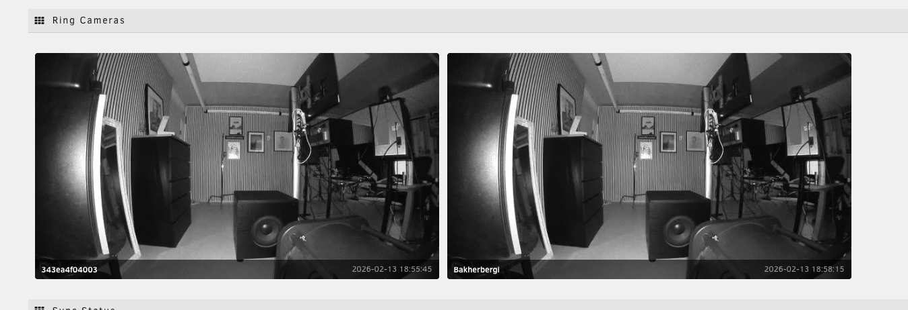

# Ring Cameras on Unraid Dashboard

Display live Ring camera snapshots directly on your Unraid Dashboard.



## What it does

- Pulls snapshots from your Ring cameras every 5 minutes
- Displays them as a native Unraid Dashboard page
- Auto-refreshes every 60 seconds
- Works with any number of Ring cameras

## Architecture

```
Ring Cloud API
      |
      v
  ring-mqtt ──snapshots──> Mosquitto MQTT
                                |
                                v
                        snapshot-saver
                                |
                                v
                        Unraid Dashboard
```

Three lightweight Docker containers:

| Container | Purpose | Port |
|-----------|---------|------|
| `ring-mosquitto` | MQTT message broker | 1883 |
| `ring-mqtt` | Ring API to MQTT bridge | 55123 (web UI) |
| `ring-snapshot-saver` | Saves snapshots as JPG files | - |

## Requirements

- Unraid 6.x or 7.x
- Ring account with cameras
- Docker and Docker Compose

## Installation

1. **Clone this repo on your Unraid server:**
   ```bash
   cd /mnt/user/appdata
   git clone https://github.com/YOUR_USERNAME/ring-unraid-dashboard.git
   cd ring-unraid-dashboard
   ```

2. **Run the installer:**
   ```bash
   bash install.sh
   ```

3. **Authenticate with Ring:**
   - Open `http://YOUR_SERVER_IP:55123` in your browser
   - Enter your Ring email and password
   - Enter the 2FA code from your authenticator app
   - Done! Snapshots start appearing within minutes

4. **Check your Dashboard:**
   - Go to your Unraid Dashboard
   - You should see a new "Ring Cameras" section

## Camera names

By default, cameras show their device ID. To give them friendly names, create a `names.json` file:

```bash
cat > /mnt/user/appdata/ring-unraid/snapshots/names.json << 'EOF'
{
  "abc123def456": "Front Door",
  "789ghi012jkl": "Backyard"
}
EOF
docker restart ring-snapshot-saver
```

To find your device IDs, check the snapshot filenames in `/mnt/user/appdata/ring-unraid/snapshots/`.

## Configuration

### Snapshot interval

Edit `/mnt/user/appdata/ring-unraid/ring-mqtt/config.json` and change `snapshot_interval` (in seconds):

```json
{
  "snapshot_interval": 300
}
```

Then restart: `docker restart ring-mqtt`

### Dashboard refresh

Edit `RingCameras.page` line 3:
```
Refresh="60"
```

## Troubleshooting

### No snapshots appearing
- Check ring-mqtt logs: `docker logs ring-mqtt`
- Check snapshot-saver logs: `docker logs ring-snapshot-saver`
- Make sure you authenticated at `http://YOUR_SERVER_IP:55123`

### Ring token expired
- Open `http://YOUR_SERVER_IP:55123` and re-authenticate

### Battery cameras not sending snapshots
- Ring battery cameras may limit snapshot frequency to preserve battery
- Cameras with very low battery may stop sending snapshots entirely

## Uninstall

```bash
cd /mnt/user/appdata/ring-unraid-dashboard
bash uninstall.sh
```

## License

MIT
